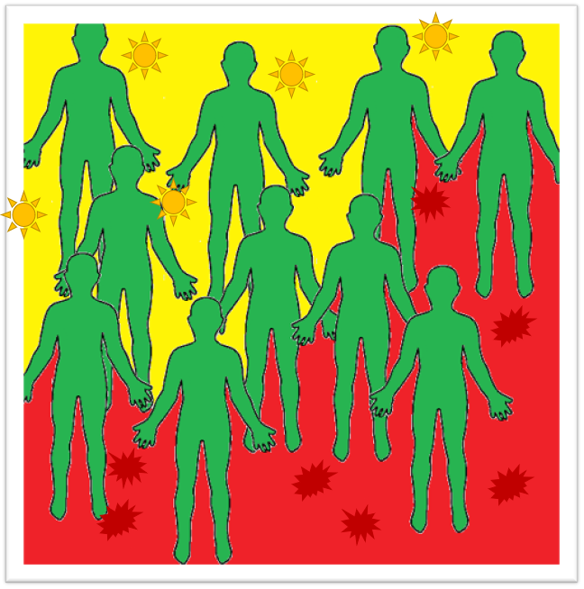

# Assignment1 - Practice Designing Models

> * Participant name: Katy Odette
> * Project Title: Renewable Energy of the Self

## General Introduction

A **smart city** is an urban area that uses different types of electronic data collection sensors to supply information which is used to manage assets and resources efficiently.

A large city, such as Orlando, deals with a range of ailments (e.g., pollution, lack of resources such as food and clean water, high energy costs, etc.) one could consider as relevant problems when creating a new beneficial and optimized smart city system. Resource regulation and renewable energy are common topics of discussion in recent years regarding the decision about how humans are going to manipulate our environment to suit our most basic needs. Electric cars, recycling, advanced filtration systems, and regulatory smart devices are just some examples of systems being created as solutions to these problems. For instance, Elon Musk is working on creating roof shingle solar panels for commercial use in the near future. Through evolution, animals adapt to their environment to withstand the survival of the fittest, but this is a slow process and for years we have found ways to evolve faster through man-made creations. A smart city not only needs smart devices that can regulate the environment, but also needs smart agents that can adapt along with the city to optimize resource flow. While man-made creations speed up the evolution process, they are still yet to be as efficient at recycling as nature's design. Thus, for this project, I propose a new, yet old, method of self-adaption that will potentially allow for a more optimized flow of resources through the human body, thus changing the way we interact with our environment. I introduce a model of "Rnewable Energy of the Self", or more informally known as, "Plant People". 

Chloroplasts and Mitochondria have an interesting relationship and the typical photosynthesis process that happens in cyanobacteria and plants relies on multiple factors, including exposure to sunlight, or visible light, surface area of the part of the body that contains the chloroplasts (e.g., the leaves/membrane/skin), and intake of water and carbon dioxide. Some of these resources happen to be the same resources that are given off from the human's metabolic pathways, within the mitochondria. While a typical house plant does not provide enough resources to sustain human life, and a human life alone does not provide enough resources alone to sustain plant life, when mitochondria and chloroplasts are placed into the same system into optimal dosages, the level of optimization could potentially increase. This is due to each system, both the photosynthesis process and the metabolic process, producing resources that the other system needs to function adequately (i.e., one system's output is another system's input). Through this system I am interested in determining if these systems could be feasibly intergrated, and if this method could be more efficient than our current way of living and functioning. This will be done by examining how many resources are depleted through each system, and regained back into the system, and if there remains any energy left to exit this system to "do work". It will also be manipulated by changing how much "outside" input is given (e.g., food, water, energy etc.), and how much "outside" output is needed by the environmental interactions (e.g., how much heat and work is needed). While current theories state that surface area is the main limiting factor for plant people creation (i.e., low surface area limits availability of sunlight energy), I'm curious to see if the energy released during the metabolic process from the mitochondria could be then transferred back into the chloroplast to produce more energy for the photosynthesis process.  

This Renewable Energy of the Self System would potentially allow for less breathing, less eating, less resource depletion, less human limitations, and more human self-regulation and equilibrium.  

## Requirements (Experimental Design)

Cities suffer when it comes to the regulation of basic resources (e.g., food, water, clean air), which leads to economical, societal, political, and medical issues. Many current projects rely on manipulating the environment in order to find a solution to these problems. This project takes a more personal approach, and examines manipulating the human directly to make the human's system potentially more efficient through integrating the chloroplast and mitochondria systems. This integrated system will have many requirements, with this current model being a simplification of this overall process. 
Sunlight will be a requirement by the human's cells in order to create the energy needed to perform both the Calvin and Krebs Cycles as well as the intermediary processes between these cycles. The system requires adequate levels of each process in order to keep the needed resources (e.g., ATP, NADH, NADPH, Oxygen, Carbon Dioxide, Glucose, Pyruvate) cycling through the system. The system will release heat when the human performs work, and this heat will be utilized to regulate body temperature.

The base integrated system will take in sunlight from the environment and convert the sunlight to heat through a set of processes. 

Process 1 SunlightEnters 
Process 2 PhotoSystem
Process 3 CalvinCycle
Process 4 Glycolysis
Process 5 KrebsCycle
Process 6 ElectronTransportSystem
Process 7 HeatReleased(Does Work)
^ Back to Process 1

## Smart City Renewable Energy of the Self Model

This Renewable Energy of the Self Model is used to describe the integration and energy cycling mechanisms between chloroplast and mmitochondria processes within the cell of a plant person.

* [**Object Diagram**](model/object_diagram.md) - provides the high level overview of components
* [**Class Diagram**](model/class_diagram.md) - provides details of the attributes in each individual component of the system as well as interactions between Mitochondria and Chloroplasts within a Plant Human Cell
* [**Behavior Diagram**](model/behavior_diagram.md) - provides low level details of the interactions between different portions of the Plant Human Cell
* [**Agent / User case** (if appropriate)](model/agent_usecase_diagram.md) - provides details of how this system can be used for benefiting human energy exchange

## Smart City Renewable Energy of the Self Simulation

I would simulate this data utilizing a discrete-event based simulation because the processes change based on current states of other subsystems. The inputs for this simulation would include changing the intensity of sunlight and the amount of other molecules(e.g., ATP, NADH, NADPH, Oxygen, Carbon Dioxide, Glucose, Pyruvate) within the system. The output of this system is the work and heat produced by the energy cycle. Some of the inputs and outputs of individual subsystems loop throughout the system. Using this simulation I could compare how much energy is consumed versus how much energy is released by the system. For the system to be feasible, it would need to create enough energy to maintain itself. For the system to be efficient, it would need to create more energy than it needs to maintain itself.
[**Katy Odette**](analysis/README.md) 

## Smart City Renewable Energy of the Self Model
[**Code template**](code/README.md) - Starting coding framework for the Renewable Energy of the Self model that can be used to regulate internal human resources.

## Renewable Energy of the Self Model
Here [**we provide an overview**](code/RNES_system/README.md) of the Renewable Energy of the Self Model and provide a source code template.
