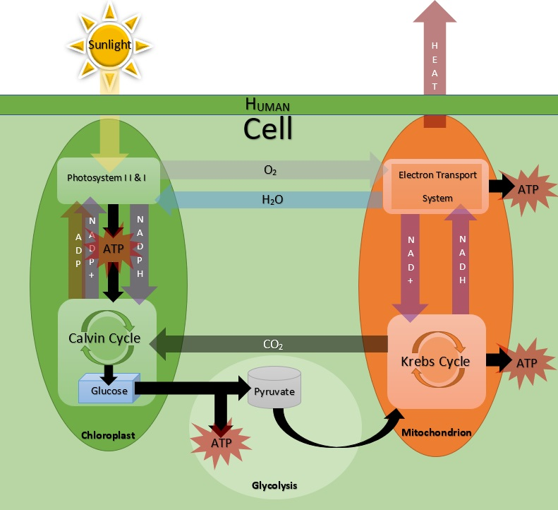

## Renewable Energy of Self Model

This code only contains 4 classes of a larger system. These 4 classes do not contain enough information to adequately run the simulation needed to compare energy input and output and to manipualte various molecular variables.

These classes, however, do show some of the variables and functions in code form and allow one to visualize how the simulation could be made and expanded upon. 

This class diagram shows what other classes could be added to create more code.

This image works as good concept art to display the goals of the simulation. 