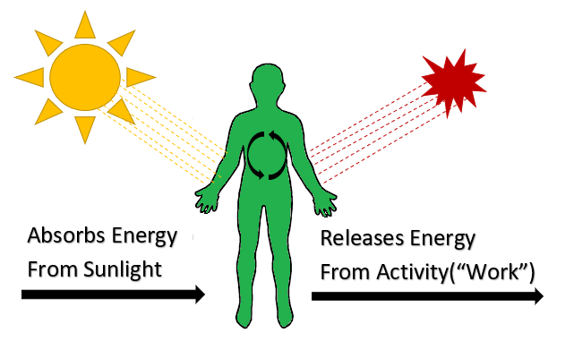

## Smart City Renewable Energy of the Self Model - Use Case Diagram

This Use Case diagram displays the main use of the simplified Renewable Energy of the Self (or "Plant People") model.

This diagram was made to simply show how the human is the model that is placed between the main input (Sunlight) and main output (Heat) of the system. The human takes in energy and releases energy. 