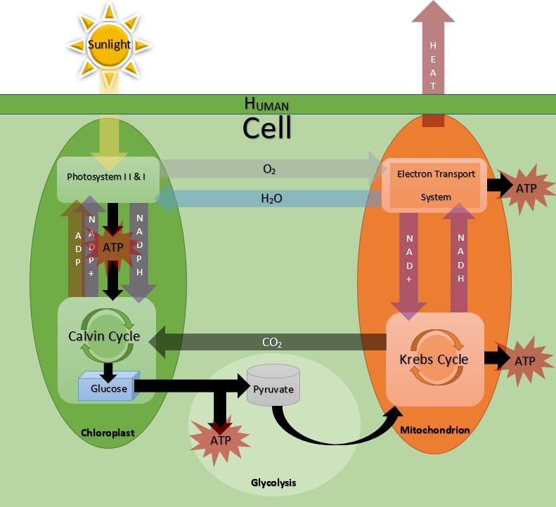

## Smart City Renewable Energy of the Self Model - Behavior Diagram

This behavior diagram displays the overall concept and logic behind the simplified Renewable Energy of the Self (or "Plant People") model.
This includes the display of interactions that occur primarily between the Chloroplasts and Mitochondria in the human cell.

It is clear from this diagram where interactions take place and where molecules are transferred between different cellular processes.