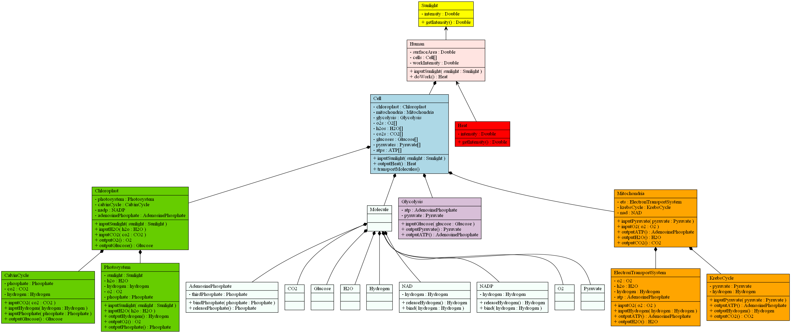

## Smart City Renewable Energy of the Self Model - Class Diagram

This class diagram displays all of the attributes and functions necessary for each component of the simplified Renewable Energy of the Self (or "Plant People") model.
This includes the display of intercellular interactions through declaring functions.

It is clear from this diagram where each molecule is typically located and where it binds with other substances during the energy cycle. This diagram also is the best example of why this data would best be analyzed using a discrete-event based simulation. 