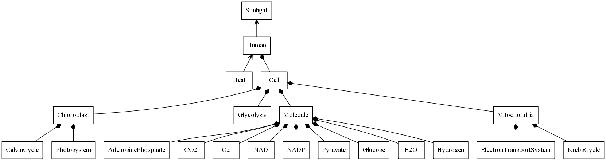

## Smart City Renewable Energy of the Self Model - Object Diagram

This object diagram contains all of the elements necessary for a simplified Renewable Energy of the Self (or "Plant People") model.
This includes both the main input, Sunlight, and the main output, Heat.
The Human element is composed of many cells, and the cells are composed of Chloroplasts, Mitochondria, as well as molecules and processes (e.g., Glycolysis) that take place in the cytoplasm of the cell. 

This system design allows for the manipulation of energy input through increasing/decreasing sunlight intensity as well as by adding additional amounts of intercellular molecules. These molecules are exchanged throughout the photosynthetic and metabolic processes. 